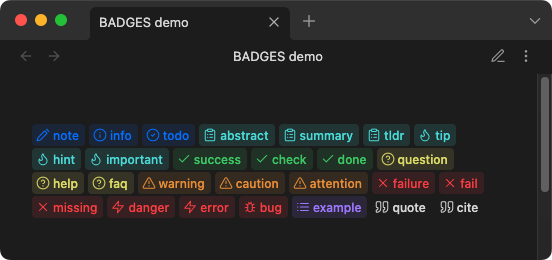
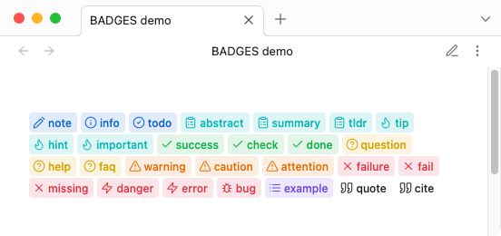
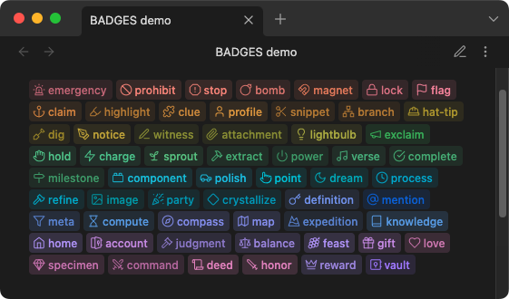
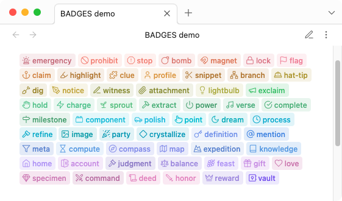
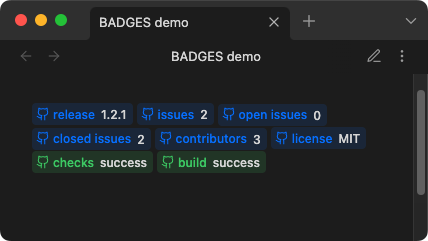
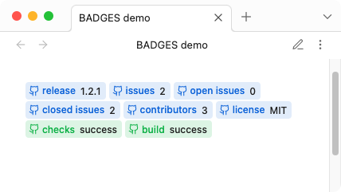
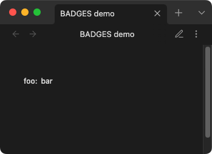
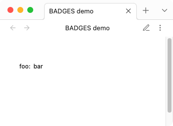
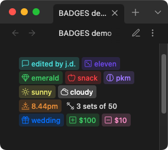
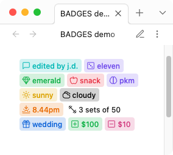

## Badges

### Introduction

A light-weight plugin for displaying inline "badges" in [Obsidian.md](https://github.com/obsidianmd) which acts similarly to a key-value store(database) for querying via default search or [Dataview](https://github.com/blacksmithgu/obsidian-dataview) plugin.

- [Usage](#usage)
	- [Github styled badges](#Github%20styled%20badges)
	- [Plain-text](#Plain-text)
	- [custom](#custom)
- [Installation](#Installation)
- [CSS styles](#CSS%20styles)
- [Dataview plugin](#Dataview%20plugin)
- [Development](#Development)
- [Notes](#Notes)

> Download: [demo markdown file](assets/badges-demo.md)

### Usage

###### default syntax

```markdown
`[!!KEY:VAL]`
```

| syntax | details                         |
| ------ | ------------------------------- |
| `KEY`  | the type and name of the `ICON` |
| `VAL`  | the value and text displayed    |

> ⚠️ Note:
> the `VAL` cannot contain either the `|` pipe or the `:` colon symbols, as they are used as delimiters for the custom syntax

###### example

```markdown
`[!!note:note]`
`[!!info:info]`
`[!!todo:todo]`
...
`[!!cite:cite]`
```

###### results




###### example

```markdown
`[!!emergency: emergency]`
`[!!prohibit: prohibit]`
`[!!stop:stop]`
…
`[!!reward: reward]`
`[!!vault: vault]`
```

###### results





#### Github styled badges

###### syntax

```markdown
`[!!|GHX>KEY:VAL]`
```

| syntax          | details                                                                            |
| --------------- | ---------------------------------------------------------------------------------- |
| <code>\|</code> | start pipe symbol                                                                  |
| `GHX`           | Github style, either `ghb` for the blue style or `ghs` for the green success style |
| `>`             | greater than symbol (delimiter)                                                    |
| `KEY:VAL`       | `KEY` is the type or label, `VAL` is the value text displayed. e.g. `release:1.0.0` |

> ⚠️ Note:
> the `VAL` cannot contain either the `|` pipe or the `:` colon symbols, as they are used as delimiters for the custom syntax

###### example

```markdown
`[!!|ghb>release:1.2.1]`
`[!!|ghb>issues:2]`
`[!!|ghb>open issues:0]`
`[!!|ghb>closed issues:2]`
`[!!|ghb>contributors:3]`
`[!!|ghb>license:MIT]`
`[!!|ghs>checks:success]`
`[!!|ghs>build:success]`
```

###### results





### Plain-text

###### syntax

```markdown
`[!!|KEY:VAL]`
```

| syntax          | details                               |
| --------------- | ------------------------------------- |
| <code>\|</code> | start pipe symbol                     |
| `KEY:VAL`       | `KEY` is the type, `VAL` is the value |

###### example

```markdown
`[!!|foo:bar]`
```

###### results





### custom

###### syntax

```markdown
`[!!|ICON|KEY:VAL|COLOR-RGB]`
```

| syntax          | details                                                                                                                |
| --------------- | ---------------------------------------------------------------------------------------------------------------------- |
| <code>\|</code> | start pipe symbol                                                                                                      |
| `ICON`          | name of icon. e.g. `lucide-dice`                                                                                        |
| <code>\|</code> | pipe symbol                                                                                                            |
| `KEY:VAL`       | `KEY` is the type or label, `VAL` is the value text displayed. e.g. `release:1.0.0`                                     |
| <code>\|</code> | pipe symbol                                                                                                            |
| `COLOR-RGB`     | 3 (R.G.B.) numeric (0-255) values, separated by commas. e.g. `144,144,144` or CSS variable e.g. `var(--color-red-rgb)` |

> ⚠️ Note:
> the `VAL` cannot contain either the `|` pipe or the `:` colon symbols, as they are used as delimiters for the custom syntax

###### example
```markdown
`[!!|message-square|comment:edited by j.d.|var(--color-cyan-rgb)]`
`[!!|dice|roll:eleven|120,82,238]`
`[!!|gem|mineral:emerald|var(--my-custom-rgb)]`
`[!!|apple|fruit:snack|var(--color-red-rgb)]`
`[!!|brain|brain:pkm|var(--color-purple-rgb)]`
`[!!|sun|weather:sunny|var(--color-yellow-rgb)]`
`[!!|cloudy|weather:cloudy|var(--mono-rgb-100)]`
`[!!|sunset|weather:8.44pm|var(--color-orange-rgb)]`
`[!!|dumbbell|reps:3 sets of 50|var(--mono-rgb-00)]`
`[!!|gift|event:wedding|var(--color-blue-rgb)]`
`[!!|plus-square|credit:$100|var(--color-green-rgb)]`
`[!!|minus-square|debit:$10|var(--color-pink-rgb)]`
```

###### results




### Installation

From Obsidian's settings or preferences:

1. ~~Community Plugins > Browse~~ pending official review
2. ~~Search for "Badges"~~

or:

1. download the latest [release archive](https://github.com/gapmiss/badges/releases/download/1.0.0/badges-v1.0.0.zip)
2. uncompress the downloaded archive
3. move the `badges` folder to `/path/to/vault/.obsidian/plugins/` 
4.  Settings > Community plugins > reload **Installed plugins**
5.  enable plugin

or:

1.  download `main.js`, `manifest.json` & `styles.css`
2.  create a new folder `/path/to/vault/.obsidian/plugins/badges`
3.  move all 3 files to `/path/to/vault/.obsidian/plugins/badges`
4.  Settings > Community plugins > reload **Installed plugins**
5.  enable plugin

### CSS styles

Custom `CSS` styles can be applied via CSS snippets. All colors and styles can be over-written just the same. See [CSS snippets - Obsidian Help](https://help.obsidian.md/Extending+Obsidian/CSS+snippets)

##### variables

```css
body {
	/* border */
	--inline-badge-border-color: transparent;
	--inline-badge-border-radius: var(--radius-s);
	--inline-badge-border: 1px solid var(--inline-badge-border-color);
	/* example custom color */
	--my-custom-rgb: var(--color-green-rgb);
}
/* example CSS customization */
.inline-badge[data-inline-badge^="vault"] {
	--badge-color: var(--color-green-rgb);
	color: rgba(var(--badge-color), .88);
	background-color: rgba(var(--badge-color),.22);
}
```

### Dataview plugin

View and copy example dataview queries: [badges-dataview](assets/badges-dataview.md)

### Development

###### Clone this repo

```bash
cd /path/to/vault/.obsidian/plugins
git clone https://github.com/gapmiss/badges.git
cd badges
```

###### Install packages and run

```bash
npm i
npm run dev
```

###### Enable plugin

1.  open `Settings` → `Community plugins`
2.  enable the `Badges` plugin.

### Notes

[Lucide](https://github.com/lucide-icons/lucide) Icons: https://lucide.dev
Lucide Icons LICENSE: https://lucide.dev/license

